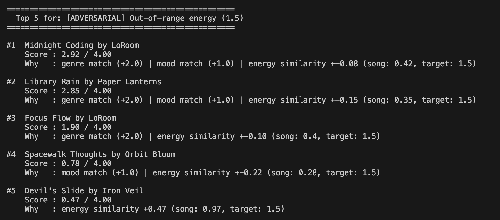
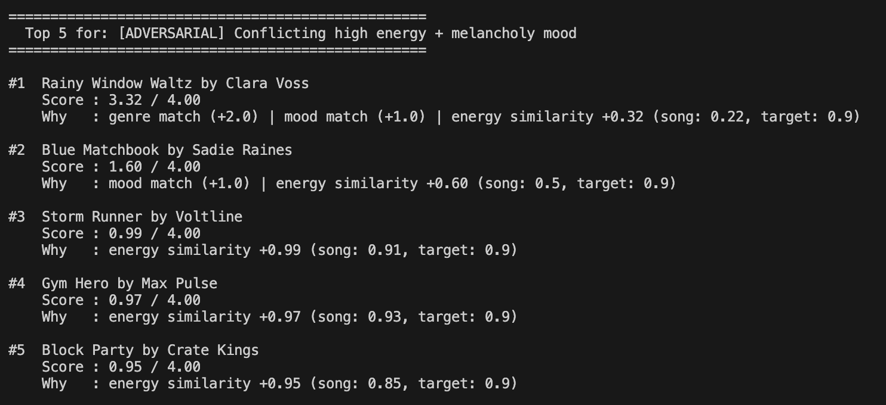
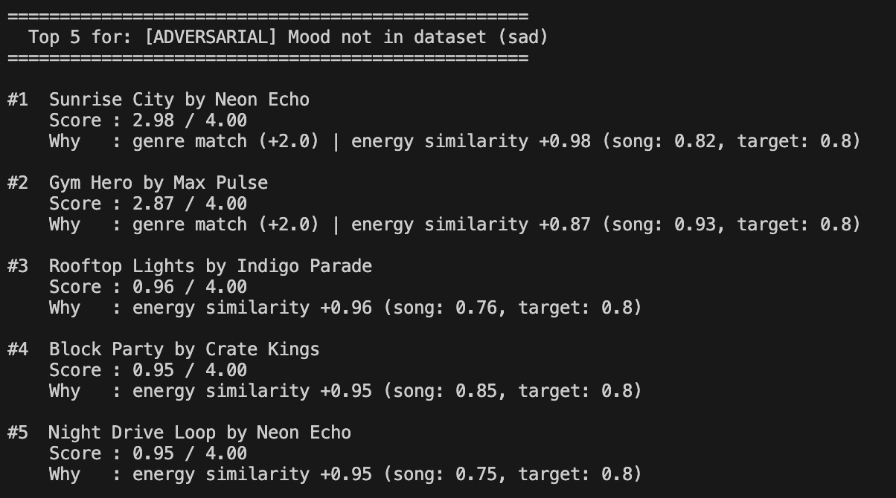
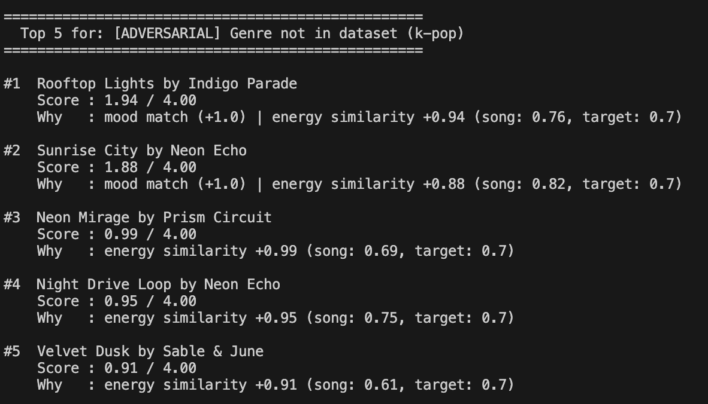
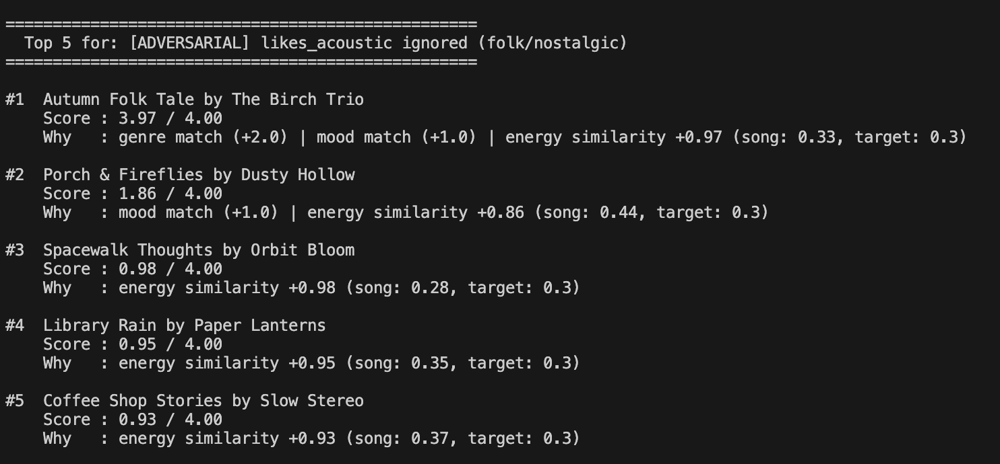

# 🎵 Music Recommender Simulation

## Project Summary

In this project you will build and explain a small music recommender system.

Your goal is to:

- Represent songs and a user "taste profile" as data
- Design a scoring rule that turns that data into recommendations
- Evaluate what your system gets right and wrong
- Reflect on how this mirrors real world AI recommenders

- GrooveMatch is a rule-based music recommender that scores songs from a 19-song catalog against a user's stated preferences — favorite genre, favorite mood, and target energy level. Each song is assigned a score up to 4.0 (genre match worth 2.0, mood match worth 1.0, and up to 1.0 for energy closeness), then the top 5 results are returned with a breakdown explaining each factor. The project explores how simple scoring formulas can produce sensible recommendations but also reveals real-world tradeoffs: genre dominates the score, acoustic preference is silently ignored, and users with underrepresented genres receive weaker candidates.

---

## How The System Works

Explain your design in plain language.

Some prompts to answer:

- What features does each `Song` use in your system
  - For example: genre, mood, energy, tempo
- What information does your `UserProfile` store
- How does your `Recommender` compute a score for each song
- How do you choose which songs to recommend

You can include a simple diagram or bullet list if helpful.

- Songs have a genre (pop, lofi, rock, jazz, etc.) and mood (happy, chill, intense, relaxed, etc.). Audio characteristics like energy, valence, danceability, acousticness, and tempo_bpm capture what the song sounds like, most on a 0–1 scale.

- The UserProfile stores four preference signals: favorite_genre, favorite_mood, target_energy (0–1 representing how high-energy the music should be), and likes_acoustic (whether the user prefers acoustic or electric-leaning sounds).

- The Recommender scores each song using an additive points recipe:
  - 2.0 if the song's genre matches the user's favorite genre
  - 1.0 if the song's mood matches the user's favorite mood
  - 0.0-1.0 for energy similarity: `1.0 - abs(song.energy - user.target_energy)
  - Maximum possible score: 4.0 (genre + mood + perfect energy match)

- Each song is scored and sorted highest to lowest. The top k songs (currently set to 5) are returned as recommendations.

**Potential biases to be aware of**
- Genre dominance: Genre is worth 2x mood, so a song that matches genre but has the wrong mood will outscore a song with the right mood but wrong genre. Users with niche genre preferences may get poor recommendations if the catalog is small.
- Cold catalog bias: If few songs in the CSV match a user's genre, the system is forced to recommend lower-scoring songs. The recommendations are only as good as what's in the data.
- Energy is the only continuous signal: Tempo, valence, and danceability are ignored entirely, so two very different-feeling songs could receive identical scores.
- Acoustic preference is not scored: The UserProfile stores "likes_acoustic" but the current recipe does not use it, meaning that signal is silently dropped.


---

## Getting Started

### Setup

1. Create a virtual environment (optional but recommended):

   ```bash
   python -m venv .venv
   source .venv/bin/activate      # Mac or Linux
   .venv\Scripts\activate         # Windows

2. Install dependencies

```bash
pip install -r requirements.txt
```

3. Run the app:

```bash
python -m src.main
```

### Running Tests

Run the starter tests with:

```bash
pytest
```

You can add more tests in `tests/test_recommender.py`.

---

## Experiments You Tried

Use this section to document the experiments you ran. For example:

- What happened when you changed the weight on genre from 2.0 to 0.5
- What happened when you added tempo or valence to the score
- How did your system behave for different types of users

- Standard Profiles: tested three baseline user types (Pop Fan, Chill Listener, Workout Mode) to verify the scoring produced sensible rankings. In all three cases the top result was a song that matched both genre and mood, confirming the additive scoring worked as intended.

- Out-of-range energy (1.5): set target_energy above the 0–1 scale. The system did not crash, but every song received a negative energy contribution since 1.0 - abs(song.energy - 1.5) is always below zero. Genre and mood bonuses still pushed matching songs to the top, but scores were lower than normal across the board.

- Mood not in dataset ("sad"): no song in the catalog has mood = sad, so the mood bonus never fired. The recommender silently fell back to genre + energy ranking with no warning. The top results were genre matches but none felt emotionally correct for the stated preference.

- Genre not in dataset ("k-pop"): same silent failure: the genre bonus never applied, so the entire top 5 was decided by energy similarity alone, surfacing songs that happened to match the target energy regardless of style.

- Conflicting preferences (classical + melancholy + high energy 0.9): the only classical song in the catalog has energy 0.22, so it received the genre bonus but a heavy energy penalty. A non-classical song with energy closer to 0.9 nearly outscored it, revealing how strongly a mismatched energy hurts a genre-matched song.

- Acousticness ignored: set a folk/nostalgic profile with likes_acoustic = True. The acousticness field is stored in the UserProfile but is never used in score_song, so two songs with acousticness 0.91 and 0.08 scored identically. The preference was silently dropped.

- Tie-breaking at energy 0.385: set target_energy exactly between the two lofi songs (Library Rain at 0.35 and Focus Flow at 0.40). Both are equidistant, so their energy scores are equal. Python's sort is stable, meaning whichever song appeared first in the CSV always wins — the tie is resolved by catalog order, not any meaningful signal.
---

## Limitations and Risks

Summarize some limitations of your recommender.

Examples:

- It only works on a tiny catalog
- It does not understand lyrics or language
- It might over favor one genre or mood

You will go deeper on this in your model card.

- Genre is weighted at 2.0 points (twice the value of mood) which means a genre-matched song with the wrong mood and wrong energy will almost always outscore a better overall fit from a different genre

- Acousticness is stored in the user profile but never used in scoring, so acoustic preference is silently ignored every time

- Moods and genres not present in the catalog (e.g. "sad", "angry", "k-pop") fail silently and the system returns results without any warning that the user's preference matched nothing

- Energy values outside the 0–1 range are accepted without validation, causing every song to receive a negative energy contribution and distorting the rankings

- There is no diversity mechanism, so the top 5 results can all come from the same genre, reinforcing what a user already listens to rather than surfacing anything new

- Tempo, valence, and danceability are loaded from the dataset but contribute nothing to the score, meaning two songs that feel very different can receive identical rankings


---

## Reflection

Read and complete `model_card.md`:

[**Model Card**](model_card.md)

Write 1 to 2 paragraphs here about what you learned:

- about how recommenders turn data into predictions
- about where bias or unfairness could show up in systems like this

- Through building GrooveMatch, I realized that the recommender system is solely a number calculated through the sum of weighted rules and lacks any understanding of music. The simplicity of this recommender allows it to be transparent, as it's easy to trace why a song ranked where t did. Real-world recommenders work in the same manner as this, but the features and weights used are much more complex and thorough instead of the simpler rules implemented in GrooveMatch. 

- The bias in the system was a consequence of the design decisions. Giving genre a 2.0 bonus seemed reasonable, but it meant the system would almost always recommend songs in the same genre regardless of mood or energy fit. A user with niche genre would receive worse recommendations simply because the catalog is smaller. Biases like this are prone to show up in real-world products, where a system that's designed to lean towards majority preferences will underrepresent users who have non-mainstream tastes. 


---

## 7. `model_card_template.md`

Combines reflection and model card framing from the Module 3 guidance. :contentReference[oaicite:2]{index=2}  

```markdown
# 🎧 Model Card - Music Recommender Simulation

## 1. Model Name

Give your recommender a name, for example:

> VibeFinder 1.0

---

## 2. Intended Use

- What is this system trying to do
- Who is it for

Example:

> This model suggests 3 to 5 songs from a small catalog based on a user's preferred genre, mood, and energy level. It is for classroom exploration only, not for real users.

---

## 3. How It Works (Short Explanation)

Describe your scoring logic in plain language.

- What features of each song does it consider
- What information about the user does it use
- How does it turn those into a number

Try to avoid code in this section, treat it like an explanation to a non programmer.

---

## 4. Data

Describe your dataset.

- How many songs are in `data/songs.csv`
- Did you add or remove any songs
- What kinds of genres or moods are represented
- Whose taste does this data mostly reflect

---

## 5. Strengths

Where does your recommender work well

You can think about:
- Situations where the top results "felt right"
- Particular user profiles it served well
- Simplicity or transparency benefits

---

## 6. Limitations and Bias

Where does your recommender struggle

Some prompts:
- Does it ignore some genres or moods
- Does it treat all users as if they have the same taste shape
- Is it biased toward high energy or one genre by default
- How could this be unfair if used in a real product

---

## 7. Evaluation

How did you check your system

Examples:
- You tried multiple user profiles and wrote down whether the results matched your expectations
- You compared your simulation to what a real app like Spotify or YouTube tends to recommend
- You wrote tests for your scoring logic

You do not need a numeric metric, but if you used one, explain what it measures.

---

## 8. Future Work

If you had more time, how would you improve this recommender

Examples:

- Add support for multiple users and "group vibe" recommendations
- Balance diversity of songs instead of always picking the closest match
- Use more features, like tempo ranges or lyric themes

---

## 9. Personal Reflection

A few sentences about what you learned:

- What surprised you about how your system behaved
- How did building this change how you think about real music recommenders
- Where do you think human judgment still matters, even if the model seems "smart"


## Output of song recommendations


## Edge-cases 

1. 

2. 

3. 

4. 

5. 

6. 